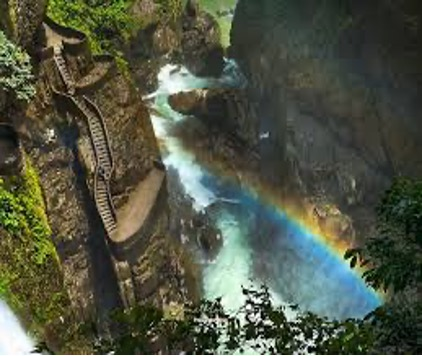

## WRITING N°4
## NATURAL WONDER
  
| |Where is it? It is in Baño, Tungurahua province  | 
|---------|------|
|EL PAILON WATERFALL| What does it look like? It is very beautiful |
|    |  What can you do there? Take photos , walk to the waterfall |
|    |   When’s a Good time to go there? Between May and November |

It is one of the best places to visit in Ecuador. Also,  it is in the top 10 of the best places to visit in the country. The best time to visit is between May and November because it is usually sunny, and it  rains at the same time. So you can see a raimbow over the waterfall. This is the most beautiful landscapes to see. In addition, the road to the waterfall is an adventure because you have to walk over a challenging bridge. Finally,  there is a small river where you can sit and eat something. If you like adventure, this is the place that you have to visit also 

