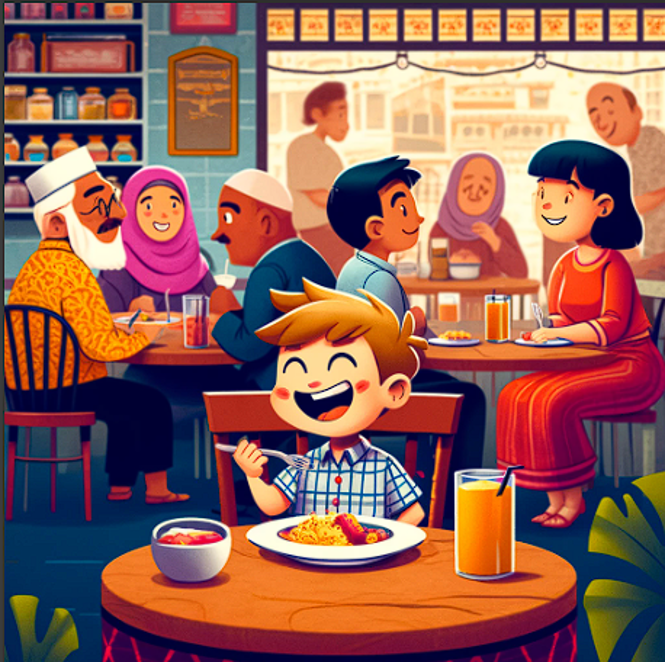

## Writing N°2
## An embarrassing moment

| When did it happen? | As a child | 
|---------|------|
| Where did it happen?    | In a restaurant   |
| Who was there?   | My family   |
| Why was it embarrassing?   | Sat down in the wrong table   |

When I was a child, I was at a restaurant with my family. We were enjoying a meal together. I got up to get some more food. I got distracted for a moment. I accidentally sat down in a wrong table with another family and I started eating their food. I thought that was my family. My family was sitting nearby. They looked at me and they started laughing. So, I turned red and I got up from that table and I joined my family again. Later my family told me that I shouldn't be distracted because something bad could happen to me. I felt bad but then I laughed because I thought it would never happen to me. To this day, my family always bothers me with this when we go out to eat at a restaurant.

