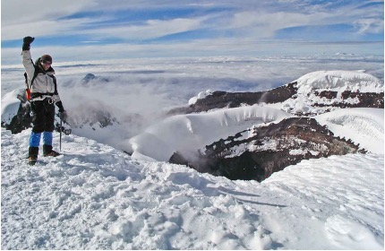

## WRITING N°3
## A special place I’ve been

| Topic | Questions | 
|---------|------|
| A special place I’ve been | **Where is this place?** |
| |Cotopaxi, a volcano in Ecuador. |
| |**What made this place so special?**|
| |The breathtaking views and the sense of adventure it brings.|
| |**Have you ever been back? Why or why not?**|
| |Yes, I have been back once. Each visit is just as amazing as the first, and it always leaves me with a sense of peace and wonder.|

One of the most special places I’ve been to is Cotopaxi, a beautiful volcano in Ecuador. This place is special because of its breathtaking views and the sense of adventure it brings. I visited Cotopaxi with my family during a vacation a few years ago. We hiked up the mountain and enjoyed the stunning scenery. The feeling of being so high up and seeing the world from above was incredible. I have been back once since then, and each visit is just as amazing as the first. I would love to go back again and explore more of the area, as it always leaves me with a sense of peace and wonder.

