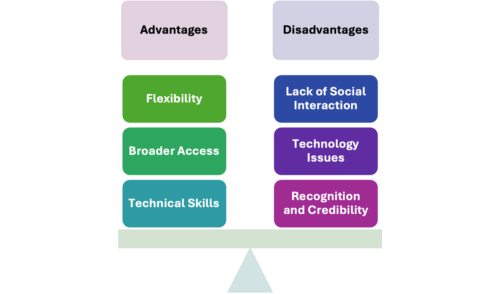

## WRITING N°1 
## Online education

 my opinion, the advantage of flexibility in online education allows each student the time to study or engage in classroom activities without the pressure of transitioning between subjects, thereby eliminating wasted time. Broader access provides a wide range of options for places to study and content for learning. Technical skills can be honed by repeatedly using various platforms, offering more than just one way to learn.

On the disadvantages, the lack of social interaction can lead to minimal socialization due to the online nature of the courses. Technology issues arise because not everyone has the same level of technological access or the necessary equipment to ensure equity. Additionally, recognition and credibility are concerns, as academic dishonesty can be more prevalent in online settings.

